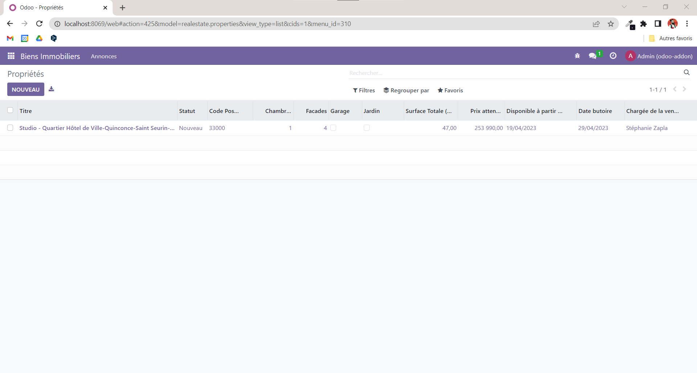
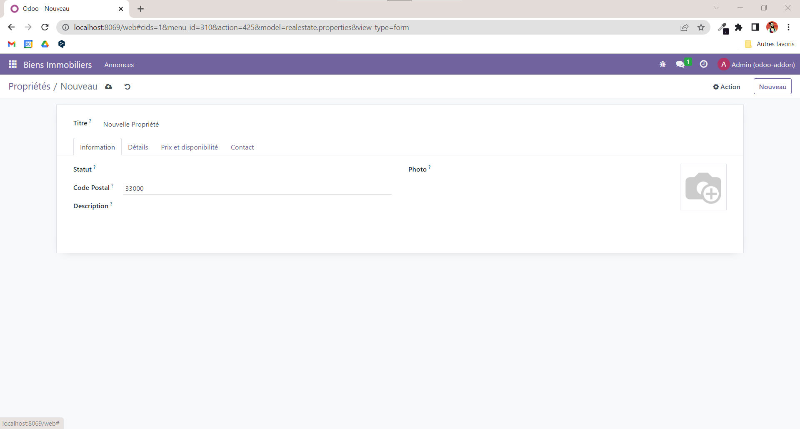

# Odoo Addon - Biens Immobiliers

Réalisé lors de mon cursurs à l'EPSI (Bordeaux) : module *"Developpement à partir d'un ERP"*, l'addon **Biens Immobiliers** est une application Odoo permettant de créer des propriétés et d'en assurer leur gestion.

Screenshot de la vue en liste :

Screenshot de la vue du formulaire de création :
